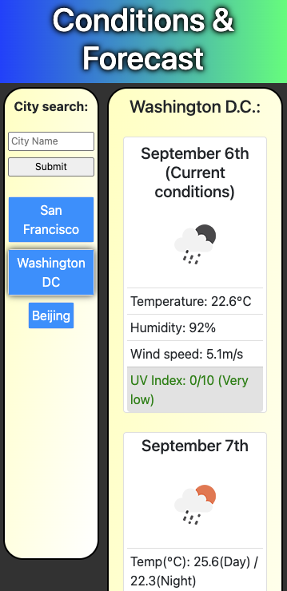

# Weather Dashboard

A basic weather dashboard.

Search for cities and see the current conditions, including temperature, humidity, wind speed, UVI index, and weather.
Additionally displays a more limited 5 day forecast for the selected location.
Search history is saved along the left of the page, and can be used to revisit a previous search result.

 Link to deployed page:
 https://gordon-magill.github.io/weather_dashboard/
 
## Authors

- [@Gordon-Magill](https://github.com/Gordon-Magill/)

